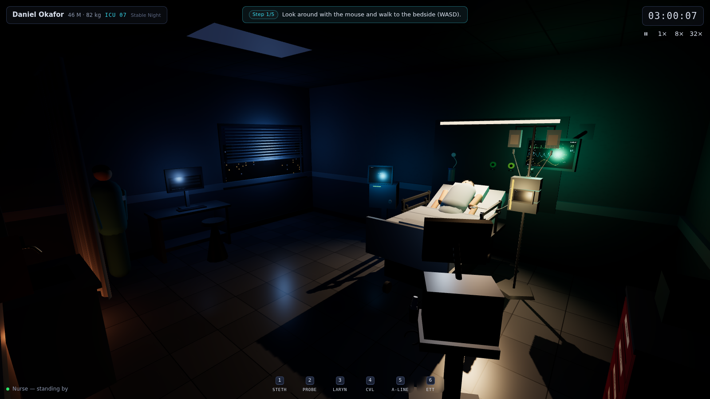
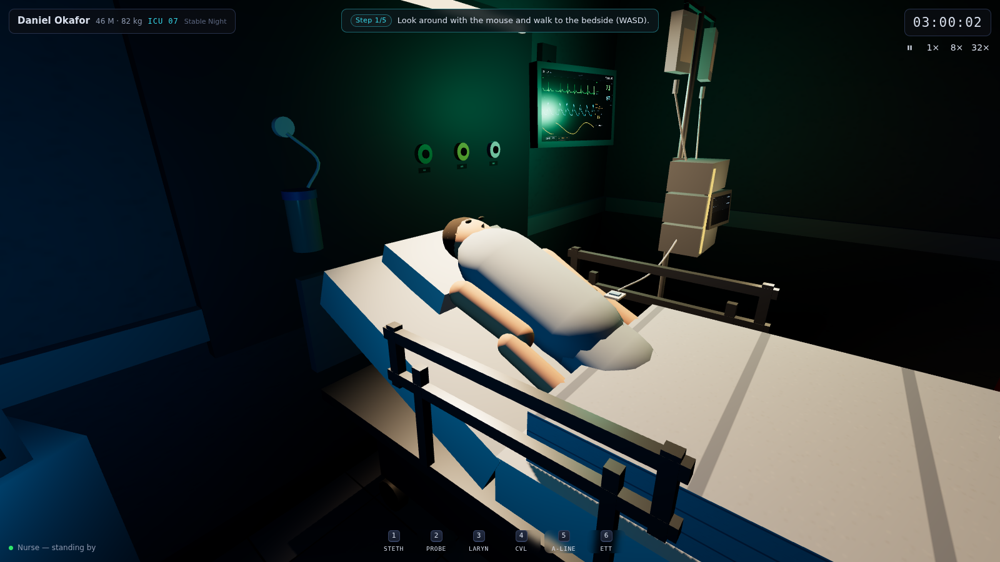
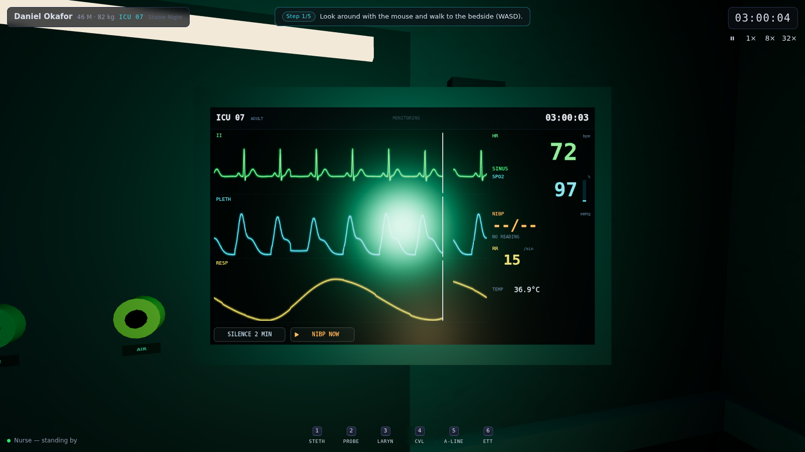
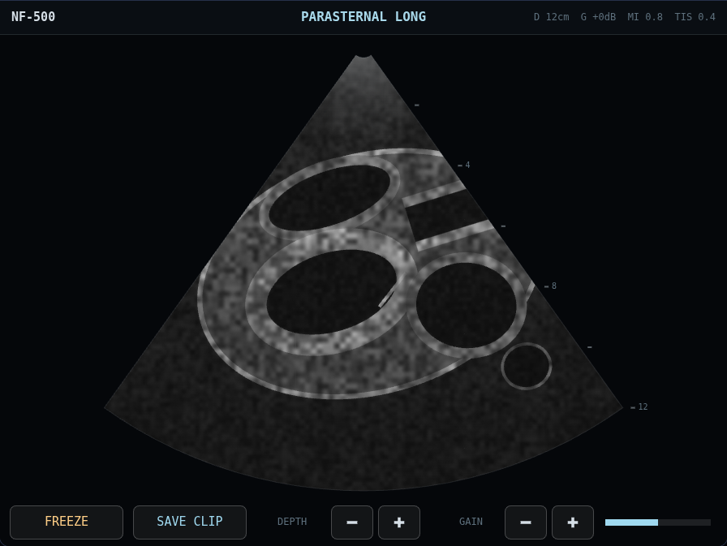
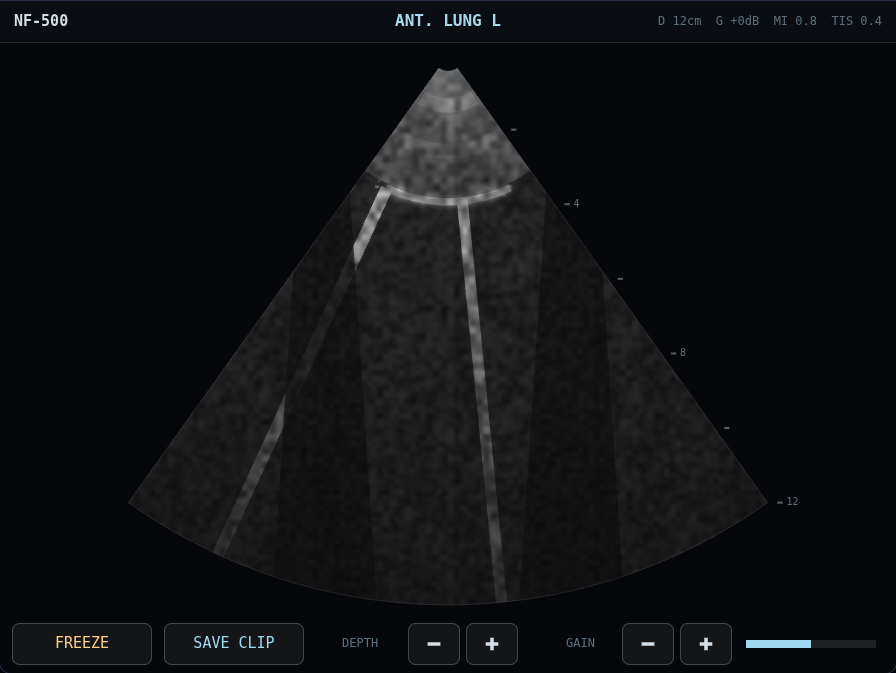

# NIGHT FLOAT

A first-person 3D ICU simulation in the browser. It's 3am, the room is dim,
the vent is cycling, the monitor is glowing — and everything works. Pick up
the probe and scan. Thread the wire. Put in an order and watch the numbers
move. Nothing is a painted-on prop.



> **Medical realism is deliberately placeholder.** The machinery is real;
> the medicine ships as clearly-tagged stubs and editable content files for a
> dedicated medical pass. See [`MEDICAL_HANDOFF.md`](MEDICAL_HANDOFF.md).

## Quickstart

```bash
cd night-float
npm install
npm run dev        # http://localhost:5173
```

No backend, no accounts, no API keys, no network at runtime. Desktop browser
only. (The optional LLM dialogue module in settings is strictly additive.)

Pick a scenario:

- **Stable Night** — the tutorial. Learn to move, examine, use the chart,
  and read the room.
- **Crashing** — a timed deterioration: alarms → fluids and vasopressors →
  a failing airway → the ventilator → (maybe) a save.

## Controls

| Input | Action |
| --- | --- |
| Mouse | look (click the room to capture the pointer) |
| `W A S D` | walk |
| `E` | interact (hold for procedure steps) · `F` `C` `V` other actions |
| `Tab` | workstation / EMR |
| `Q` | verbal orders (radial menu) |
| `1–6` | tools: stethoscope, US probe, laryngoscope, CVL kit, art-line kit, airway kit |
| `Space` | pause · `-` `+` (or `[` `]`) time compression 1× / 8× / 32× |
| `Esc` | close overlay · settings |

## What's in the room

- **Patient monitor** — live synthesized ECG / pleth / resp / art / capno
  waveforms (sweep-erase drawing, beat-accurate), NIBP cycling, alarms with
  priorities, silence windows, and auto time-drop on new alarms.
- **Ventilator** — VC / PC / PS on a single-compartment lung model; settings
  change the pressure/flow/volume loops and can trip real alarms.
- **Pumps** — channels the nurse actually programs; titrate from the EMR,
  the radial menu, or the pump screen.
- **Ultrasound** — a procedural renderer with 12 views (cardiac, IVC, lungs,
  FAST). Findings are parametric and change with the patient. Freeze, save
  clips to the chart, and use the linear-probe procedural mode for lines.
- **Procedures** — central line, arterial line, intubation: data-defined
  steps, hold-gestures, sterile field, complications, and payoffs (the art
  trace appears; EtCO2 lights up).
- **The nurse** — consumes your orders with realistic task timing, hangs
  drips, draws labs, and tells you when the pressure's soft.
- **EMR workstation** — orders (search/favorites/titration), MAR, results
  with trends, flowsheet strip charts, saved media, notes.
- **Debrief** — every run ends with a rubric-scored timeline over the vitals
  strip, plus full JSON export of the event log.
- **Save/load** — save from settings, resume from the menu (localStorage).

## Screenshots

| | |
| --- | --- |
|  |  |
|  |  |

## Development

```bash
npm run verify     # typecheck + lint + unit tests + Playwright smoke tour
npm run test       # vitest only
npm run smoke      # Playwright only (boots the dev server itself)
npm run handoff    # regenerate MEDICAL_HANDOFF.md from TODO(MEDICAL) tags
```

- [`ARCHITECTURE.md`](ARCHITECTURE.md) — module map, data flow, the
  engine/render/UI boundary.
- [`CONTENT_AUTHORING.md`](CONTENT_AUTHORING.md) — add a drug, scenario,
  ultrasound finding, or procedure (worked examples).
- [`DECISIONS.md`](DECISIONS.md) — one-liners for every judgment call.
- [`PROGRESS.md`](PROGRESS.md) — build log by phase.

The simulation engine is pure TypeScript (no renderer/UI imports — lint-
enforced), fixed-timestep at 10 Hz, and deterministic per seed: a scenario
plus a command script replays an identical event log.
